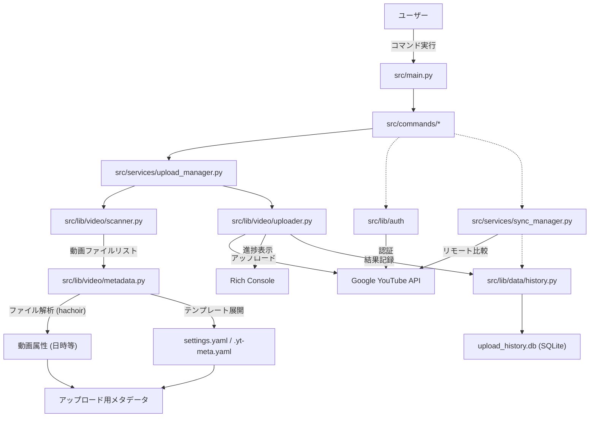

# アーキテクチャ設計書 (Architecture Guide)

`youtube-bulkup` のシステムアーキテクチャ、主要コンポーネント、およびデータフローについて解説します。

## 1. プロジェクト概要

本ツールは、ローカルディレクトリ内の動画ファイルを走査し、メタデータを自動生成した上で YouTube Data API を介して一括アップロードを行う CLI アプリケーションです。
Python で実装されており、`typer` による CLI インターフェースと `rich` によるリッチなコンソール出力を特徴としています。

## 2. ディレクトリ構造

主要なディレクトリとファイルの役割は以下の通りです。

```text
youtube-bulkup/
├── .github/          # GitHub Actions ワークフロー定義
├── docs/             # 開発者向けドキュメント
├── src/              # ソースコード本体
│   ├── commands/     # CLIコマンド定義 (auth, upload, history, video, playlist, retry, sync, quota...)
│   ├── lib/          # 共通モジュール・コアロジック
│   │   ├── auth/     # 認証・プロファイル管理 (auth.py, profiles.py)
│   │   ├── core/     # 設定・ログ (config.py, logger.py)
│   │   ├── data/     # データ永続化 (history.py)
│   │   └── video/    # 動画処理 (metadata.py, playlist.py, scanner.py, uploader.py, manager.py)
│   ├── services/     # ビジネスロジック (upload_manager.py, sync_manager.py)
│   └── main.py       # アプリケーションエントリーポイント
├── tests/            # pytest によるテストコード (srcと同様の構成)
├── client_secrets.json # GCP OAuth クライアント情報 (ユーザーが配置)
├── settings.yaml     # ユーザー設定ファイル
└── tokens/           # 認証トークン保存ディレクトリ
```

## 3. データフロー

アプリケーションの主な処理フローは以下の通りです。



## 4. 主要コンポーネント詳細

### 4.1 CLI エントリーポイント (`src.main`, `src.commands`)
- `src.main` は `src.commands` 配下の各モジュールを `typer` アプリケーションとして統合します。
- `auth`, `upload`, `video`, `playlist`, `history`, `retry`, `reupload`, `sync`, `quota` などのコマンドロジックは `src.commands` パッケージに分離されています。

### 4.2 認証モジュール (`src.lib.auth`)
- `google-auth-oauthlib` を使用して OAuth 2.0 フローを処理します。
- `src.lib.auth.profiles` で複数プロファイル（トークン）の管理を行います。

### 4.3 ビジネスロジック (`src.services`)
- **UploadManager (`upload_manager.py`)**: アップロードプロセス全体のオーケストレーション（スキャン、重複チェック、Quota残量チェック、メタデータ生成、アップロード）を担当します。
- **SyncManager (`sync_manager.py`)**: ローカル履歴とYouTube上の動画を比較し、差分レポートやローカル専用レコードの自動修正を行います。

### 4.4 動画処理モジュール (`src.lib.video`)
- **Scanner (`scanner.py`)**: ディレクトリ走査と動画ファイル検出を行います。
- **Metadata (`metadata.py`)**: `hachoir` を用いて動画ファイルのメタデータを抽出し、テンプレート設定（`settings.yaml` / `.yt-meta.yaml`）に基づいてアップロード用に整形します。
- **PlaylistManager (`playlist.py`)**: YouTube Playlist API とのやり取りをカプセル化し、プレイリストの取得・作成・動画追加・名前変更・一覧表示を行います。APIコール削減のためのキャッシュ機能を備えています。
- **VideoManager (`manager.py`)**: 動画の公開設定変更、メタデータ更新、サムネイル変更、動画削除、動画一覧取得（公開状態付き）を行います。
- **Uploader (`uploader.py`)**: YouTube Data API v3 をラップし、リジューム可能なアップロード・リトライ処理・サムネイルアップロードを提供します。

### 4.5 データ管理 (`src.lib.data`)
- **History (`history.py`)**: SQLite3 を利用してアップロード履歴を管理します。`file_hash`, `file_path`, `video_id`, `status`, `timestamp` にインデックスを作成し、高速なクエリを実現。WALモードで並行読み取り性能を向上しています。エクスポート/インポート機能、既存TinyDB (JSON) からの自動マイグレーション機能を備えています。

### 4.6 コアモジュール (`src.lib.core`)
- **Config (`config.py`)**: `settings.yaml` からアプリケーション設定（認証、アップロード、メタデータテンプレート、Quota上限）を読み込みます。
- **Logger (`logger.py`)**: 統一されたロギング設定。
