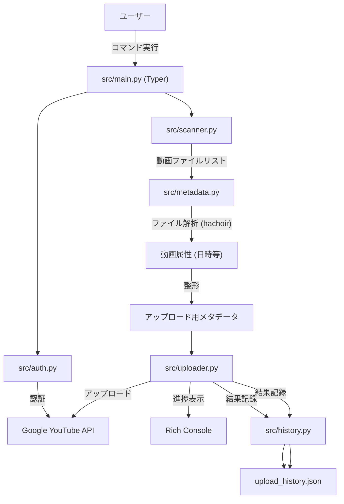

# アーキテクチャ設計書 (Architecture Guide)

`youtube-bulkup` のシステムアーキテクチャ、主要コンポーネント、およびデータフローについて解説します。

## 1. プロジェクト概要

本ツールは、ローカルディレクトリ内の動画ファイルを走査し、メタデータを自動生成した上で YouTube Data API を介して一括アップロードを行う CLI アプリケーションです。
Python で実装されており、`typer` による CLI インターフェースと `rich` によるリッチなコンソール出力を特徴としています。

## 2. ディレクトリ構造

主要なディレクトリとファイルの役割は以下の通りです。

```text
youtube-bulkup/
├── .github/          # GitHub Actions ワークフロー定義
├── docs/             # 開発者向けドキュメント
├── src/              # ソースコード本体
│   ├── auth.py       # OAuth2.0 認証ハンドリング
│   ├── config.py     # 設定ファイル (settings.yaml) の読み込み・管理
│   ├── history.py    # アップロード履歴管理 (JSON/DB)
│   ├── logger.py     # ロギング設定
│   ├── main.py       # エントリーポイント・CLI コマンド定義
│   ├── metadata.py   # 動画ファイルからのメタデータ抽出・生成ロジック
│   ├── scanner.py    # ディレクトリ走査・動画ファイル検出
│   ├── uploader.py   # YouTube Data API ラッパー・アップロード処理
│   └── ...
├── tests/            # pytest によるテストコード
├── client_secrets.json # GCP OAuth クライアント情報 (ユーザーが配置)
├── settings.yaml     # ユーザー設定ファイル
└── tokens/           # 認証トークン保存ディレクトリ
```

## 3. データフロー

アプリケーションの主な処理フローは以下の通りです。



## 4. 主要コンポーネント詳細

### 4.1 CLI エントリーポイント (`src.main`)
- `typer` を使用してコマンド引数の解析を行います。
- `auth`, `upload`, `reupload` などのサブコマンドをオーケストレーションします。

### 4.2 認証モジュール (`src.auth`)
- `google-auth-oauthlib` を使用して OAuth 2.0 フローを処理します。
- 複数プロファイル管理に対応しており、`tokens/` ディレクトリ配下にプロファイルごとのトークンを保存します。

### 4.3 スキャナー (`src.scanner`)
- 指定されたディレクトリを再帰的（または非再帰的）に走査し、アップロード対象の動画ファイルをリストアップします。
- 隠しファイルやシステムファイルを除外するフィルタリング機能も持ちます。

### 4.4 メタデータ生成 (`src.metadata`)
- **役割**: 動画ファイルそのものと、そのパス情報から YouTube 用のメタデータ（タイトル、説明、タグ）を生成します。
- **技術**: `hachoir` ライブラリを使用して動画ヘッダから撮影日時や長さなどの情報を抽出します。
- **仕様詳細**: 詳細な生成ルールについては [METADATA_SPEC.md](./METADATA_SPEC.md) を参照してください。

### 4.5 アップローダー (`src.uploader`)
- YouTube Data API v3 の `videos.insert` メソッドをラップしています。
- `googleapiclient.http.MediaFileUpload` を使用して、再開可能なアップロード（Resumable Upload）を実装しています。
- ネットワークエラー時の指数バックオフによるリトライ処理 (`tenacity` 利用) を行います。

### 4.6 履歴管理 (`src.history`)
- `tinydb` を利用して `upload_history.json` にアップロード結果を記録します。
- **重複排除**: ファイルのハッシュ値を用いて、既にアップロード済みのファイルを検出・スキップします。
- **再アップロード**: ファイルハッシュやYouTube Video IDを用いた履歴検索により、特定のファイルの履歴削除や再アップロードをサポートします。
